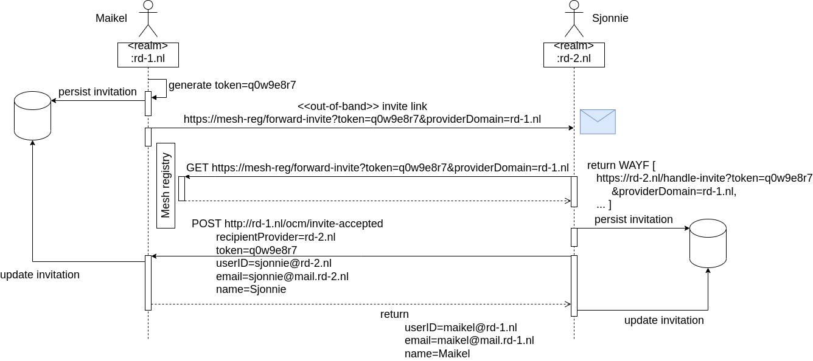

# Research Drive Mesh app

---
### Enhanced federated sharing between Research Drive instances.
This app gives an enhanced federated sharing user experience by implementing an Invitation Workflow. Through a simple invitation by email to a user of another owncloud instance the federated (cloud) IDs are automatically exchanged and saved on the each other's systems. From thereon both users can easily start federated sharing with each other via the common file sharing dialog.
 
 
! Depends on the following apps: Federation, Share Files

---

#### Features
* [Implements an invitation workflow](#invitation-workflow)
* Implements searchable remote users

#### Development
* [How to build the app](#build-the-app)

#### Installation and running the app
After building extract `build/artifacts/appstore/rd-mesh.tar.gz` and place the `rd-mesh` folder into the `app` folder of your owncloud instance.

Finally the admin should activate the app. It should than be present as a menu entrance for all users.

---
### Invitation Workflow
 
