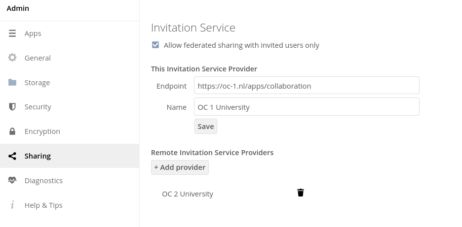

# Invitation app for Federated Sharing

---
### Enhanced federated sharing between Owncloud instances.
This app makes for an enhanced federated sharing user experience.<br>
Through a simple one-time invitation by email to a person known to have an account on another Owncloud instance some selected user information (including cloud ID) is automatically exchanged and saved on each other's systems. From thereon both users can easily issue federated shares between each other via the regular file sharing dialog, because the system will also search for and display invited remote users along with local users.<br>
<br>
<br>
Fig.1 Sharing a photo with invited remote user Lex. 
<br>

#### Features:
* Implements an [_Invitation Workflow_](#invitation-workflow)
* Implements searchable _invited_ (remote) users

#### Dependencies:
Depends on the following Owncloud apps: _Federated File Sharing_, _Notifications_

---
### Contents
1. [Building and Installation](#building-and-installation)
2. [Configuration](#configuration)
3. [Contributing](#contributing)
4. [Invitation Workflow](#invitation-workflow)

---
### Building and installation
Clone the project. The app runs in Owncloud so have a local Owncloud instance running. To deploy the app in your local Owncloud instance build it by first running `composer` from the project root folder as you would for any php project. This will create the `vendor` dependencies folder.<br>
Next build the project by executing the command: `make version={version_number} buildapp`<br>
This will create the `invitation_version_number.tar.gz` file in the `build/artifacts/app` folder. After extracting you must place the resulting `invitation` folder in the `apps` folder of your local Owncloud instance. This should make Owncloud aware of the app.<br>
Now you can activate it and start experimenting. For a full experience you should setup 2 instances between which you can send invitations and create federated shares.

#### Using (official) releases
Use one of the [official releases](https://github.com/sara-nl/oc-invitation/releases) or build your own compressed archive as explained [here](release/README.md).<br>
Deploy the app by copying the extracted `invitation` folder of the official release or your own custom build to the Owncloud `apps` folder.<br>
Finally the admin should activate the app. It should than be present as a menu entrance for all users.

#### Activation
To activate enhanced federated sharing (search and display invited remote users in the share dialog) the following configuration must be added to the `config.php` file of the Owncloud instance:
```
sharing.remoteShareesSearch' => '\\OCA\\Invitation\\Service\\RemoteUserService
```

---
### Configuration
To be able to send invitations between Owncloud instances the app must be installed on each one of them.<br>
Also you must configure the other (remote) instances you want to be able to send invitations to. This is done on the admin settings section of the app (Settings page -> Admin Sharing page -> Invitation Service section).<br>
<br>
<br>
Fig.2 Invitation app settings page.<br>

##### checkbox - Allow federated sharing with invited users only
* Enabling this option prevents owncloud from showing the label of an uninvited remote user when typing in a cloud ID in the share dialog. Only invited remote users' labels will be displayed to you (as shown in [figure 1](../#enhanced-federated-sharing-between-owncloud-instances)).<br>
*&nbsp;Note that this option does not actually disable federated sharing functionality with uninvited remote users but just does not show the label of an uninvited remote user.

##### section - This Invitation Service Provider
 * Here you should specify the endpoint and name of this instance's Invitation Service Provider.<br>
 The endpoint structure is as follows: `https://[host]/[path]/apps/invitation`

##### section - Remote Invitation Service Providers
 * Here you should specify all Invitation Service Providers you want to enable exchanging cloud IDs via invitations with.<br>
 Click the 'Add Provider' button, fill in the remote provider's endpoint and click 'Save'. The availablity of the remote provider will be verified before it will be added.<br>
To remove a remote provider click the thrashbin icon of the relevant provider. This will disable invitation functionality with that Owncloud instance.

---
### Contributing
When contributing please perform the following checks locally before pushing code to the repo. Github workflows will do these checks too:
1. Run `make php-codesniffer-errors` from the project root folder and fix the errors before pushing to the repo.<br>
For your convenience `make php-codesniffer-errors-fix` will take care of most errors.<br>
The PSR-12 code formatting style is followed.

2. Run the integrations tests from the `tests/docker` folder with the following command:<br>
`docker compose --verbose --progress=plain -f docker-compose-local.yaml run --build --entrypoint /bin/sh --rm integration-tests -- ./tmp/tests/tests.sh`<br>
Check the outcome of the tests and fix any issue.<br>
*Note: you should remove at least the volumes before running the tests again because those are not removed after running locally. The `docker-cleanup.sh` script specifically created for that can be found [here](https://github.com/sara-nl/oc-invitation/blob/main/tests/docker/docker-cleanup.sh).

##### CI/CD
* Upon pushing commits a workflow doing some codechecking is executed. You should [prepare](#contributing) for that.
* [Building a release .tar.gz file](release/README.md)

#### Development options
* Display the generated invite link:<br>
Add the key/value set to the db `appconfig` table to display the invite link after an invitation has been created:

| appid      | configkey   | configvalue      |
|------------|-------------|------------------|
| invitation | deploy_mode | deploy_mode-test |

<br>

---

### Invitation Workflow
The Invitation Workflow has been designed with sync-and-share systems in mind. It implements a controlled exchange of user information between sync-and-share systems. This can be particularly usefull in the case of federated sharing were some knowledge (eg. user id) of the remote user is required.<br>
The workflow starts off by sending an invitation via email to the remote counterpart with the request to exchange user information (see figure 2 below).<br> The actual exchange of user information takes place in the final step of the invitation workflow. This step (`HTTP POST request /invite-accepted`) is part of the [Open Cloud Mesh specification](https://cs3org.github.io/OCM-API/docs.html?branch=v1.1.0&repo=OCM-API&user=cs3org#/paths/~1invite-accepted/post).<br>
Handling of the invitation is regulated by a _Mesh Registry Service_ that has knowledge of all systems between which user information may be exchanged.<br>
<br>
<br>
Fig.3 - The invitation workflow as it is implemented in the Invitation app.
