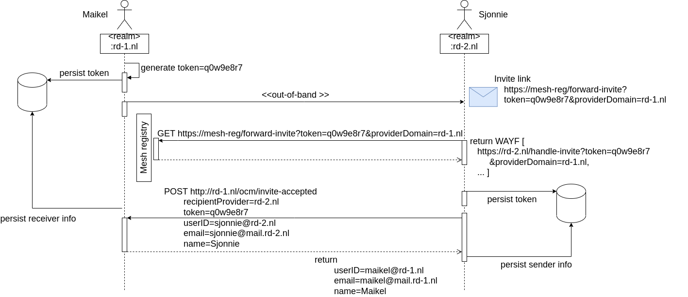

# Invitation app for Federated Sharing

---
### Enhanced federated sharing between Owncloud instances.
This app gives an enhanced federated sharing user experience by implementing an Invitation Workflow. Through a simple invitation by email to a user of another owncloud instance the federated user (cloud) IDs are automatically exchanged and saved on each other's systems. From thereon both users can easily start federated sharing with each other via the regular file sharing dialog, because the share dialog will also search for and display invited remote users.  

Fig. 1 Sharing a photo with invited remote user Lex. 
 
 
#### Dependencies: 
Depends on the following apps: _Federated File Sharing_, _Notifications_

---

#### Features
* [Implements an invitation workflow](#invitation-workflow)
* Implements searchable invited (remote) users

#### Building and running locally
Clone the project. The app runs in Owncloud so have a local Owncloud instance running. To deploy the app in your local Owncloud instance build it by first running `composer` from the project root folder as you would for any php project. This will create the `vendor` dependencies folder. 
Next build the project by executing the command: `make version={version_number} buildapp` 
This will create the `invitation_version_number.tar.gz` file in the `build/artifacts/app` folder. After extracting you should place the resulting `invitation` folder in the `apps` folder of your local Owncloud instance. This should make Owncloud aware of the app. 
Now you can activate it and start experimenting. For a full experience you should setup 2 instances between which you can send invitations and create federated shares.

#### Contributing
Please perform the following checks locally before pushing code to the repo. Github workflows will do these checks too:
1. Run `make php-codesniffer-errors` and fix the errors before pushing to the repo. 
For your convenience `make php-codesniffer-errors-fix` will take care of most errors.

2. Run the integrations tests from within the `tests/docker` folder with the following command: 
`docker compose --verbose --progress=plain -f docker-compose-local.yaml run --build --entrypoint /bin/sh --rm integration-tests -- ./tmp/tests/tests.sh` 
Check the outcome of the tests and fix any issues.

#### CI/CD
* Upon pushing commits a workflow doing some codechecking is executed. You should [prepare](#contributing) for that.
* [Building a release .tar.gz file](release/README.md)

#### Deployment
Use one of the [official releases](/sara-nl/oc-invitation/releases) or build your own compressed archive as explained [here](release/README.md). 
Deploy the app by copying the extracted `invitation` folder of the official release or your own custom build to the Owncloud `apps` folder.

Finally the admin should activate the app. It should than be present as a menu entrance for all users.

#### Installation
To do ...

---
### Invitation Workflow

Fig.2 The invitation workflow as it is implemented.
