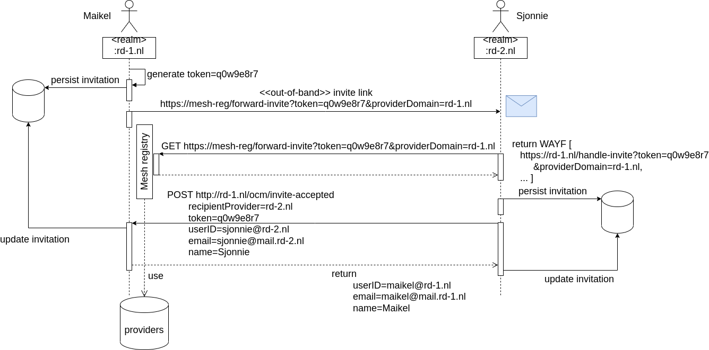

# Research Drive Mesh app

---
### Enhanced federated sharing between Research Drive instances.
This app gives an enhanced federated sharing user experience by implementing an Invitation Workflow. Through a simple invitation by email to a user of another owncloud instance the federated (cloud) IDs are automatically exchanged and saved on the each other's systems. From thereon both users can easily start federated sharing with each other via the common file sharing tab.
<br>
<br>
! Depends on the following apps: Federation, Share Files

---

#### Features
* [Implements an invitation workflow](#invitation-workflow)
* Implements a federated IDs address book

#### Development
* [How to build the app](#build-the-app)
---
### Invitation Workflow
 

### Build the app
```$ make appstore```