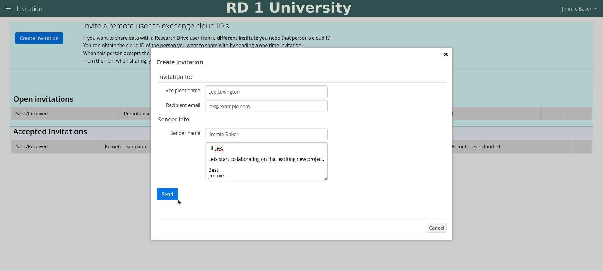
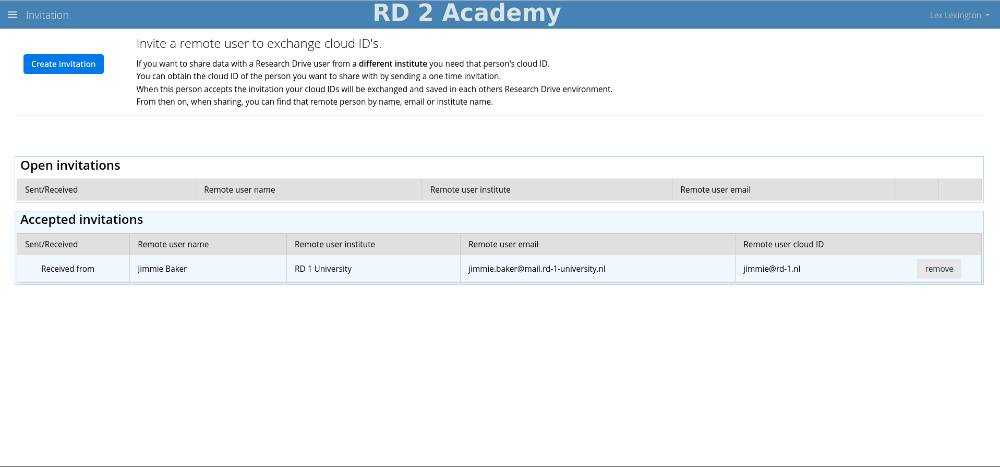

# Invitation App User Manual

## Invitation App

For a federated share you need the cloud ID of the remote user. Obtaining the cloud ID from the remote user is inconvenient at best. The Invitation App facilitates controlled and user-friendly exchange of this cloud ID between your and the remote user's system. From then on you can create federated shares with each other just as easy as regular shares with local users. 

The exchange process consists of two basic steps:
1. the initiator/sender sends an invitation (to exchange cloud IDs)
2. the receiver accepts the invitation (to exchange cloud IDs)

The result is that, after accepting, both users can search for each other when sharing, just as they can search for local users. 
Federated sharing becomes as easy as local sharing.

## Instructions
Let's consider two Research Drive users from different institutes, Jimmie and Lex, who are collaborating in a national project. They want to share documents with each other through Research Drive, but since they are from different institutes they can't find each other in their Research Drive environments. The instructions below explain how the Invitation App can help with this.

---

### Where to find the Invitation App

The Invitation App can be found in the upper left-hand corner.

 
Fig.1 - Where to find the Invitation App. 
 

### Sending an invitation

Jimmie has opened the Invitation App index page in his Research Drive environment.

 
Fig.2 - The Invitation App index page. 
 

To create an invitation click the 'Create Invitation' button and fill in the fields. 
The email of the receiver does not have to be an institutional email address, but can also be a personal one. 
All fields are required except the message field.

 
Fig.3 - Create invitation for Lex. 
 

After clicking the 'Send' button a confirmation message will popup asking you to confirm if the displayed information may be shared with the intended recipient. 
Click the 'Ok' button to confirm, or decline by clicking the 'x' button in the upper right-hand corner. 
*&nbsp;Note that the optional message will only be send with the email, but will not be exchanged with or saved on the remote user's Research Drive instance.

 
Fig.4 - Information exchange confirmation. 
 

If 'Ok' is clicked the email will be send to Lex and the invitation will appear as an open invitation to Lex.

 
Fig.5 - Open Invitation sent to Lex. 
 

#### Revoking an invitation

At this point Jimmie may decide to revoke the invitation by clicking the 'revoke' button. This will invalidate the invitation. Even though the invitation mail has been send it will not be possible for Lex to accept the invitation, and no cloud IDs will be exchanged.

### Receiving the invitation email

Lex will now receive the invitation in his mailbox. 
In the email Lex can click the 'Uitnodiging accepteren' button to follow through with the invitation.

 

 
Fig.6 - Open Invitation sent to Lex. 
 

### Choosing the Research Drive environment of your institute to log in to

If Lex clicks the 'Uitnodiging accepteren' button he will be redirected to a page that allows him to choose the Research Drive environment of his institute.

 
Fig.7 - Choose your institute. 
 

### Log in to your Research Drive environment

Lex logs in to his Research Drive environment.

 
Fig.8 - Lex logs in to his Research Drive environment. 
 

### View the received open invitation

After login Research Drive shows the Invitation App index page where the open invitation from Jimmie can be found.

 
Fig.9 - Lex sees the open invitation from Jimmie. 
 

#### Open invitation notification

It is not required to handle the open invitation straight away. You can start doing other things and come back later on this page via the upper left-hand corner menu. 
There is also a notification for each received invitation. If you click on the notifications bell it will be displayed and you can click on it to return to the open invitation.

 
Fig.10 - Click on the notification to return to the open invitation from Jimmie. 
 

### Accept/decline the open invitation

If you click on the 'accept' button a confirmation popup will appear that shows what information will be exchanged with the sender of the invitation. Click the 'Ok' button to confirm, or the 'x' button in the upper right-hand corner of the popup to decline.

If you click on the 'decline' button the invitation will be removed and no user information will be exchanged with the sender. That means that there will be no enhanced support for federated sharing between sender and receiver of the invitation.

 
Fig.11 - A confirmation dialog is displayed when clicking the 'accept' button of the invitation. 
 

When clicking the 'Ok' button the invitation is accepted and will be displayed as an accepted invitation. 
This goes for Jimmie in his Research Drive environment as well.

 
Fig.12 - Display the accepted invitation. 
 
#### Removing an accepted invitation

Both sender and receiver can remove an accepted invitation by clicking the 'remove' button, however, an accepted invitation exists on both sender and receiver Research Drive environments and removing it on one environment does not affect the invitation on the other. If eg. the sender removes the accepted invitation this removes the cloud ID and information of the remote user (the receiver) from the Research Drive environment of the sender. The consequence is that the sender cannot search for the receiver anymore when creating a share. A federated share for the receiver can still be created by the sender but only by filling in the cloud ID 'by hand'. 
Since the invitation always also exists on the receiver's environment he or she still sees the invitation as accepted and still can search for the sender when creating shares. 
If the receiver also decides to remove the invitation the consequences are similar but then it's the sender that cannot be found anymore by the receiver. 
It's important to note that removing invitations only impacts the invitation between the two users involved but not invitations they may have with other users. 
 
Please also note that <b>no existing shares are affected when removing an invitation!</b> 

### Successful exchange of cloud IDs and enhanced federated sharing support

Lex has accepted the invitation and now Jimmie's cloud ID is known by the system, and vice versa. 
Both Lex and Jimmie can now experience the enhanced support for federated sharing with each other. 
By typing in name, email or institute name labels displaying matching users will appear. Clicking a label will create the share for that user. 
Note that invited remote users are clearly distinguishable from local users. See figure 13 below.

 
Fig.13 - Share a file with an invited remote user. 
 
